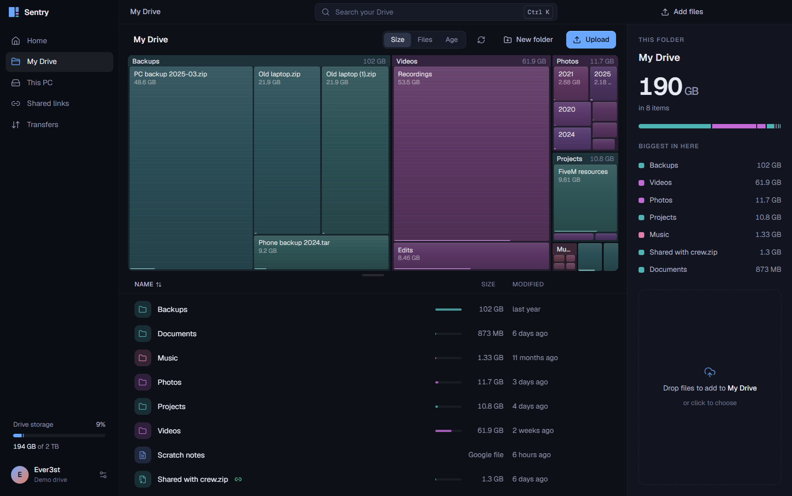

<p align="center">
  
</p>

<h1 align="center">Sentry</h1>

<p align="center">A storage map for your PC and Google Drive.</p>

<p align="center">
  <a href="https://github.com/IEver3st/Sentry/releases/latest"><strong>Download for Windows</strong></a>
  &nbsp;·&nbsp;
  <a href="#connect-google-drive">Connect Google Drive</a>
  &nbsp;·&nbsp;
  <a href="#development">Development</a>
  &nbsp;·&nbsp;
  <a href="https://github.com/IEver3st/Sentry/issues">Report an issue</a>
</p>



*The app running with its built-in demo drive. All files shown are sample data.*

Sentry shows your files as a map: the bigger the tile, the more space it takes. Browse a folder on your PC, find large files, or connect Google Drive to manage your cloud storage alongside it. You can start with **This PC only** and add Drive later.

## What you can do

- **Find where the space went.** Explore local folders and Drive storage by size, file count, or age. Select a tile to inspect the file behind it.
- **Manage Drive files.** Search, rename, move, star, and trash files. Create folders and manage public sharing links.
- **Move files between PC and Drive.** Drop files into Sentry to upload, download them to a folder you choose, and track or cancel transfers. Google Docs, Sheets, and Slides export to Office formats.
- **Review local files.** Open items, reveal them in Explorer, or move selected items to the Recycle Bin after confirmation. Cache and build-output labels are suggestions to review, not automatic cleanup rules.
- **Keep transfers going in the tray.** Closing to the tray keeps jobs running. Hidden windows pause UI refreshes and progress updates, then catch up when reopened.
- **Use it from Explorer.** Add a “Send to Google Drive” command and Send to shortcut from Settings. Choose whether uploads go to My Drive or a “From my PC” folder.

## Install

1. Open the [latest release](https://github.com/IEver3st/Sentry/releases/latest) and download `Sentry-Setup-<version>-x64.exe`.
2. Run the installer, then choose **This PC only**, **This PC and Google Drive**, or **Try a demo drive**.
3. Adjust appearance, tray behavior, download location, and updates in Settings.

Releases currently target **Windows x64**. The installer is unsigned, so Windows may show a publisher warning. Each release includes `SHA256SUMS.txt` for checking the downloaded files.

Installed copies check GitHub Releases for updates. Automatic downloads and installation on quit are configurable in **Settings → Updates**. Development runs do not auto-update.

## Connect Google Drive

Drive is optional. Connecting it currently requires your own **Google Cloud Desktop app OAuth client**; Sentry does not ship a shared client.

1. Create or select a [Google Cloud project](https://console.cloud.google.com/) and enable the **Google Drive API**.
2. Configure the OAuth consent screen. For an external client in Testing, add your Google account as a test user.
3. Create an OAuth client with application type **Desktop app** and download its JSON file. Google's [desktop setup guide](https://developers.google.com/workspace/drive/api/quickstart/python#authorize_credentials_for_a_desktop_application) covers this step.
4. In Sentry's setup screen or **Settings → Drive & account**, import the client JSON.
5. Choose the Google Drive connection option and finish signing in through your browser.

Sentry requests the full `drive` scope so it can work with existing files, including moving, sharing, and trashing them. Google classifies this as a [restricted scope](https://developers.google.com/workspace/drive/api/guides/api-specific-auth); broader distribution of an OAuth client is subject to Google's verification requirements.

Sign-in uses a local callback with PKCE. OAuth tokens are encrypted through Electron's `safeStorage` in the app's local profile; Sentry refuses to save them as plaintext. The imported client configuration is also stored in that profile. Keep client files and tokens out of commits and issue attachments.

<details>
<summary>Developer credential options</summary>

`SENTRY_GOOGLE_CLIENT_ID` and `SENTRY_GOOGLE_CLIENT_SECRET` take precedence over an imported client file. The file may use Google's downloaded `installed` format or `{ "clientId": "...", "clientSecret": "..." }`. Web application clients are rejected.

</details>

## A few boundaries

Uploads are explicit. Sentry does not watch folders or keep local and cloud copies continuously in sync. Local scanning works without Google; Drive operations need a connection.

Restore cloud items through Google Drive's trash and local items through the Windows Recycle Bin. Sentry does not include its own restore screen.

The demo drive keeps uploaded files on your PC and supports a local upload/download round trip. Its seeded sample files contain metadata only, so they cannot be downloaded.

## Development

Built with Electron, React, TypeScript, Tailwind CSS, and Zustand. Storage maps use D3 hierarchy; electron-vite handles the build.

The Windows release workflow uses **Node.js 22** and **Bun 1.3.6**.

```powershell
git clone https://github.com/IEver3st/Sentry.git
cd Sentry
bun install --frozen-lockfile
bun run dev
```

If Electron's binary is missing, run `node node_modules/electron/install.js`. If Electron starts as plain Node and reports a missing `BrowserWindow` export, clear the inherited flag in PowerShell:

```powershell
Remove-Item Env:ELECTRON_RUN_AS_NODE -ErrorAction SilentlyContinue
bun run dev
```

<details>
<summary>Build and verification commands</summary>

```powershell
bun run typecheck
bun run test:google
bun run test:performance
bun run test:notifications
node --test tests/release-config.test.mjs tests/release-assets.test.mjs
bun run build
bun run test:scan
bun run test:window
bun run capture:background
bun run capture
bun run dist
```

`build` writes to `out/`; `dist` creates a Windows installer in `dist/`. Scan and window checks need a completed build.

The Google tests use mocked responses. The capture commands use a separate demo profile and an offscreen Electron window, writing screenshots and results under `capture/`. These checks cover app behavior without proving live Google transfers or a complete installed update and relaunch.

See [release instructions](docs/releases.md) for version tags, packaging, checksums, and the public update feed.

</details>

```text
src/main/          Drive providers, transfers, local scans, settings, tray, updates
src/preload/       Typed bridge between the desktop process and the interface
src/renderer/src/  Pages, storage maps, components, and application state
src/shared/        IPC types and file categories
```

## Earlier Sentry Backup project

This repository now contains the Drive and local-storage app. The earlier backup application's source remains on [backup/sentry-backup-before-drive-20260925](https://github.com/IEver3st/Sentry/tree/backup/sentry-backup-before-drive-20260925). The current app does not migrate its backup jobs, repositories, or credentials.

## License

[MIT](LICENSE).
